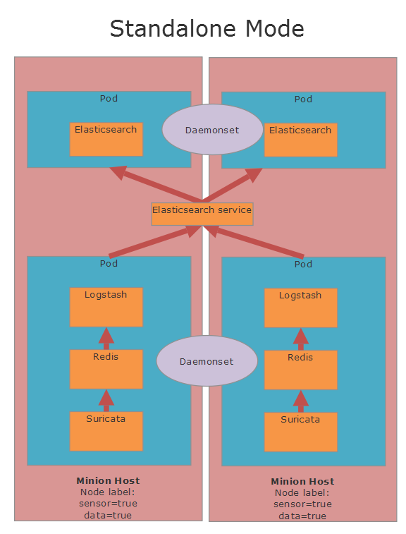
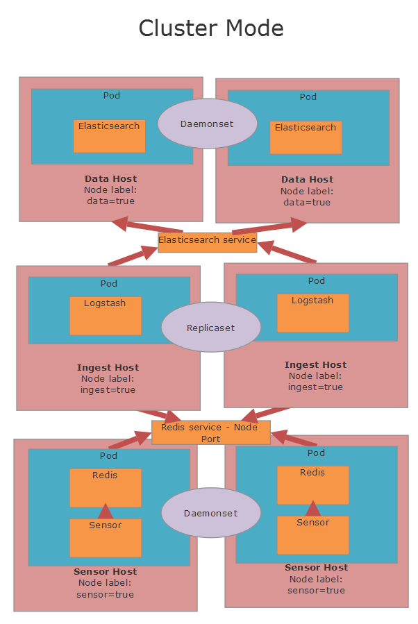
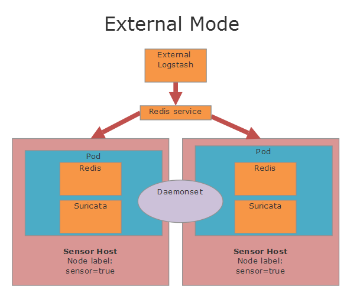

# Deployment Options for Sensors

Sensors can be in a number of modes depending on the design of the cluster.  Check the documentation for each sensor to view the modes the tools are capable of operating in.  

## Standalone Mode

This mode has all services on all systems that are dedicated to the sensor.  Elasticsearch can be on the same system, but this is optional and doesn't need to be the case.  Sensors will gather information and then send directly to Redis on the same physical host in the same pod.  Redis will then store the information where it will be gathered by Logstash, parsed and then sent to the Elasticsearch service.  These connections will then be load balanced to the Elasticsearch instances on the cluster (Can be on the same physical hosts, but not necessary).  In this mode Sensors and the supporting containers (Redis and Logstash) will be deployed to all hosts tagged as sensor=true.  In this mode CPU pinning is necessary for the sensor containers where applicable (Suricata and Bro).  The traffic processing containers will run on a single physical CPU and all the other containers will run on another.  Sensors can be load balanced easily in this mode.  See the guide on CPU pinning for more information.

## Cluster Mode
Cluster mode is designed for allowing your cluster to scale in a more controllable manner.  In this mode it is possible to scale out the sensors and the data ingest layers separately.  Sensors will reside on a dedicated host and then information will be sent to a separate set of systems dedicated for data ingest.  Sensors can be load balanced if desired, but don't have to be.  It is also possible to have sensors deployed in multiple locations across the network.

##External Mode
External mode allows for data to be sent outside of the Kubernetes cluster into any Redis instance.  Redis can be hosted on an another Kubernetes cluster (Such as another EDCOP cluster deployed in another location that is reachable through a VPN).

